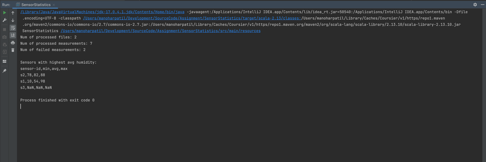

# Assignment: SensorStatistics

How to configure a SensorStatistics from IntelliJ Run Configurations Window?

Output

How to configure a SensorStatisticsSpec from IntelliJ Run Configurations Window?

Test Cases Result

